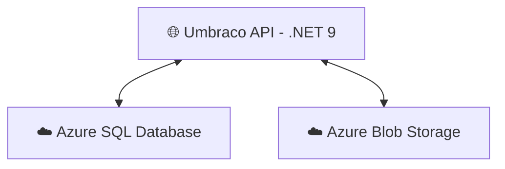

# Dynamic Portfolio v3 - Backend

<!-- Badges -->
[](https://dotnet.microsoft.com/)
[](https://learn.microsoft.com/en-us/aspnet/core)
[](https://umbraco.com/)
[](https://learn.microsoft.com/en-us/azure/azure-sql/)
[](https://learn.microsoft.com/en-us/azure/storage/blobs/storage-blobs-introduction)


---

## 📖 Intro  

This is my **backend project** for my [Dynamic Portfolio v3 project](https://github.com/filip-io/Portfolio-Umbraco-React). 

It is built with **ASP.NET Core (.NET 9)** and **Umbraco CMS 16**, exposing a **Headless Delivery API** consumed by the frontend. The API is **hosted on Azure as a Web App**, with media stored in **Azure Blob Storage** and content in **Azure SQL Database**.

---

<!-- Tech Stack Banner -->
<p align="center">
  
</p>

---


## 🛠️ Tech Stack  
 
- 🟣 **Platform:** [ASP.NET Core (.NET 9)](https://dotnet.microsoft.com/)  
- 🧩 **CMS:** [Umbraco CMS 16](https://umbraco.com/)  
- 🔑 **Headless API:** Umbraco Content Delivery API, hosted as **Azure Web App**
- ☁️ **Storage:**  
  - Azure Blob Storage (media + ImageSharp caching)  
  - Azure SQL Database (content & configuration)  
- ⚙️ **Configuration:**  
  - Wide-open **CORS** for local development  
  - Restricted **CORS** for production (only frontend origin)  
- 📦 **Packages:**  
  - `Umbraco.Cms` (core CMS)  
  - `Umbraco.StorageProviders.AzureBlob` (media storage)  
  - `Umbraco.StorageProviders.AzureBlob.ImageSharp` (image cache)  
  - `uSync` (configuration & content sync)  


&nbsp;

## ✨ Features  

- Headless CMS API exposing content for frontend  
- Media files served via **Azure Blob Storage**  
- Content & configuration stored in **Azure SQL Database**  
- Configurable via **Umbraco Backoffice**   


&nbsp;


## 📦 Installation & Setup  

### Backend (ASP.NET Core + Umbraco)
```bash
# clone repo
git clone https://github.com/filip-io/Portfolio-Umbraco-Backend.git
cd Portfolio-Umbraco-Backend

# restore dependencies
dotnet restore

# run locally
dotnet run
```

&nbsp;

## 🏛️ Architecture diagram

